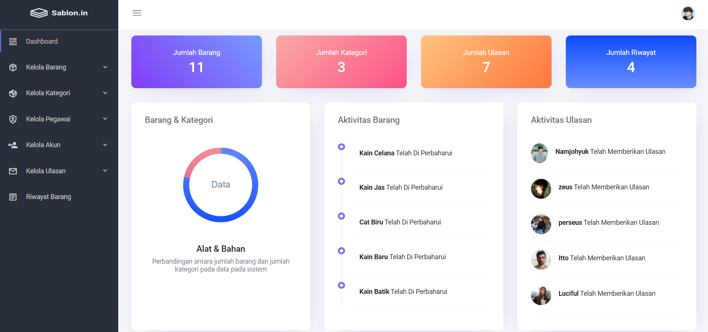

<div id="top"></div>

<!-- PROJECT LOGO -->
<br />
<div align="center">
  <a href="https://github.com/othneildrew/Best-README-Template">
    
  </a>

  <h3 align="center">Sablon.in</h3>

  <p align="center">
    Website untuk mengelola perlengkapan sablon.
    <br />
    <a href="https://github.com/farulwananda/docs-api-sablonin"><strong>Dokumentasi »</strong></a>
    <br />
</div>

<!-- ABOUT THE PROJECT -->

## 📌 About The Project



Sablon.in adalah website yang digunakan untuk mengelola setiap kebutuhan sablon terutama peralatan atau bahan-bahan yang akan digunakan dalam proses menyablon sehingga dapat memudahkan pengguna dalam mengelola bisnis.

Fitur - fitur website Sablon.in:

- Pengelolaan Barang
- Pengelolaan Kategori
- Pengelolaan Pegawai
- Pengelolaan Hak Akses Login
- Ulasan Pelanggan

Fitur website Sablon.in dapat bertambah atau berubah seiring dengan permintaan pengguna demi mencapai kenyamanan dan kepuasan pengguna.

<p align="right">(<a href="#top">Back to top</a>)</p>

## 📌 Built With

Project dibuat dengan menggunakan beberapa software / bahasa pemrograman / framework diantaranya yaitu :

- [PHP 8.0](https://windows.php.net/download)
- [phpMyAdmin 5.1.1](https://www.phpmyadmin.net/)
- [Laragon](https://laragon.org/download/index.html)

<p align="right">(<a href="#top">Back to top</a>)</p>

<!-- GETTING STARTED -->

## 📌 Run Project

Project dapat dijalankan dengan cara :

1. Cloning repository project.
2. Import database phpMyAdmin.
3. Jalankan project menggunakan localhost Laragon / Xampp .

### 🔗 Access Project

Sablon.in dilengkapi dengan fitur login, untuk melanjutkan maka dibutuhkan akses akun dengan ketentuan sebagai berikut :

- Login
  ```sh
  Username : admin0
  Password : admin0
  ```

<p align="right">(<a href="#top">Back to top</a>)</p>

<!-- CONTRIBUTING -->

## 📌 Contributing

Project ini terbuka untuk umum, bagi programmer yang ingin membantu mengembangkan project akan **sangat diapresiasi**.

Jika anda memiliki kritik dan saran terkait dengan project silahkan hubungi kontak yang tertera dibawah atau ingin mengembangkan project lebih lanjut dengan melakukan :

1. Fork Project
2. Buat Branch Anda (`git checkout -b feature/AmazingFeature`)
3. Commit Perubahan (`git commit -m 'Add some AmazingFeature'`)
4. Push Branch (`git push origin feature/AmazingFeature`)
5. Lakukan Pull Request

<p align="right">(<a href="#top">Back to top</a>)</p>

<!-- LICENSE -->

## 📌 License

Project Didistribusikan di bawah MIT License. Silahkan membuka `LICENSE.txt` untuk informasi lebih lanjut.

<p align="right">(<a href="#top">Back to top</a>)</p>

<!-- CONTACT -->

## 📌 Contact

Farul Ahmad Wananda | Web Developer - [Github](https://github.com/farulwananda)

Project Link: [Sablon.in](https://ws-tif.com/sablon-in/websites/admin-page/login-page)

<p align="right">(<a href="#top">Back to top</a>)</p>
